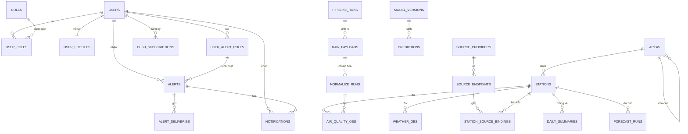

# Tài liệu Cơ sở dữ liệu — Hệ thống Giám sát Chất lượng Không khí Việt Nam (CLKKVN)

> CSDL: **PostgreSQL** · Database: `sky_pulse` · Kiến trúc: **Hướng miền (Domain-Driven Design)** chia theo *schema* nghiệp vụ.
> Quy mô: **9 schema · 56 bảng · 12 view · ~100 quan hệ khóa ngoại.**

---

## 1. Tổng quan kiến trúc

Hệ thống tổ chức dữ liệu theo **bounded context** (mỗi schema là một miền nghiệp vụ độc lập), giúp tách bạch trách nhiệm, dễ phân quyền và bảo trì:

| Schema | Miền nghiệp vụ | Số bảng | Vai trò |
|---|---|---|---|
| `iam` | Identity & Access Management | 7 | Người dùng, phân quyền, xác thực |
| `catalog` | Dữ liệu chuẩn (master data) | 3 | Trạm quan trắc, đơn vị hành chính, lưới điểm |
| `ingest` | Thu thập dữ liệu | 8 | Pipeline lấy dữ liệu từ nguồn ngoài |
| `core` | Dữ liệu quan trắc thô | 3 | Quan trắc không khí / thời tiết / giao thông |
| `analytics` | Phân tích phái sinh | 13 | Thống kê, bất thường, xu hướng, sức khỏe |
| `forecast` | Dự báo (Machine Learning) | 7 | Mô hình & kết quả dự báo AQI |
| `app` | Tính năng ứng dụng | 10 | Cảnh báo, thông báo, tùy chọn người dùng |
| `ops` | Vận hành & giám sát | 5 | Nhật ký, migration, cấu hình, health |
| `public` | Tiện ích chung | 1 | Extension & function dùng chung |

### Luồng dữ liệu xuyên suốt

```
   Nguồn ngoài (WAQI, IQAir, OpenWeather, Open-Meteo...)
            │
            ▼
   [ingest]  ──► thu thập (outbound_requests) → lưu thô (raw_payloads)
            │     → chuẩn hóa (normalize_runs), điều phối bởi pipeline_runs
            ▼
   [core]    ──► air_quality_observations / weather_observations / traffic_observations
            │     (đã gắn về trạm trong [catalog])
            ├──────────────┬───────────────────┐
            ▼              ▼                   ▼
   [analytics]        [forecast]          [app]
   thống kê,          mô hình ML,         đánh giá ngưỡng → cảnh báo
   bất thường,        dự báo AQI          → thông báo (email/push/in-app)
   sức khỏe                                     │
                                                ▼
                                          [iam] người nhận
   [ops] giám sát & ghi nhật ký toàn bộ vòng đời ở trên
```

**Trục liên kết trung tâm:** hầu hết các bảng nghiệp vụ đều tham chiếu tới `catalog.stations` (trạm quan trắc) và/hoặc `iam.users` (người dùng) — đây là hai "hub" của toàn bộ mô hình quan hệ.

---

## 2. Schema `iam` — Định danh & Phân quyền

**Vai trò:** quản lý tài khoản người dùng, vai trò (RBAC), phiên đăng nhập và các token bảo mật. Là nguồn "ai là ai" cho toàn hệ thống.

### 2.1. `iam.users` — Tài khoản người dùng
Bảng gốc lưu mọi tài khoản (đăng ký email lẫn đăng nhập mạng xã hội).

| Cột | Kiểu | Ý nghĩa |
|---|---|---|
| `id` | uuid (PK) | Khóa chính |
| `email` | citext (UNIQUE) | Email (không phân biệt hoa/thường) |
| `password_hash` | text | Mật khẩu đã băm bằng `bcrypt` (hàm `crypt()`) |
| `status` | enum | Trạng thái: `active`/`suspended`... |
| `auth_provider` | varchar | `local` / `google` / `facebook` |
| `google_id`, `facebook_id` | varchar | Định danh OAuth (đăng nhập mạng xã hội) |
| `avatar_url` | varchar | Ảnh đại diện |
| `email_verified_at` | timestamptz | Mốc xác thực email (NULL = chưa xác thực) |
| `last_login_at` | timestamptz | Lần đăng nhập gần nhất |
| `created_at`, `updated_at` | timestamptz | Thời điểm tạo/cập nhật |

### 2.2. `iam.roles` — Danh mục vai trò
Các vai trò hệ thống: `user`, `admin`, `super_admin`, `operator`, `analyst`. Cột: `id`, `code` (UNIQUE), `name`, `description`.

### 2.3. `iam.user_roles` — Gán vai trò cho người dùng (N–N)
Bảng nối giữa `users` và `roles`. Cột: `user_id` → `users`, `role_id` → `roles`, `assigned_by` → `users` (ai cấp quyền), `assigned_at`. Ràng buộc UNIQUE `(user_id, role_id)`.

### 2.4. `iam.user_profiles` — Hồ sơ người dùng (1–1)
Thông tin hiển thị tách khỏi bảng xác thực: `user_id` (UNIQUE) → `users`, `display_name`, `avatar_url`, `phone`, `metadata` (jsonb).

### 2.5. `iam.refresh_sessions` — Phiên làm mới token
Lưu refresh token đã băm để gia hạn đăng nhập: `user_id`, `refresh_token_hash`, `ip_address`, `user_agent`, `expires_at`, `revoked_at`.

### 2.6. `iam.password_reset_tokens` — Token đặt lại mật khẩu
Phục vụ "Quên mật khẩu": `user_id`, `token_hash`, `expires_at` (hết hạn 1 giờ), `used_at` (đánh dấu đã dùng).

### 2.7. `iam.email_verification_tokens` — Token xác thực email
Phục vụ luồng xác thực email khi đăng ký: `user_id`, `token_hash`, `expires_at` (24 giờ), `used_at`.

**Quan hệ nội bộ:** mọi bảng `user_profiles`, `user_roles`, `refresh_sessions`, `password_reset_tokens`, `email_verification_tokens` đều `user_id → users.id` (xóa user thì xóa theo — `ON DELETE CASCADE`).

---

## 3. Schema `catalog` — Dữ liệu chuẩn (Master Data)

**Vai trò:** lưu các thực thể tham chiếu cố định ít thay đổi: trạm quan trắc, ranh giới hành chính, lưới điểm nội suy. Là "danh mục" mà các schema khác trỏ về.

### 3.1. `catalog.stations` — Trạm quan trắc (73 bản ghi)
| Cột | Kiểu | Ý nghĩa |
|---|---|---|
| `id` | uuid (PK) | Khóa chính |
| `code` | text (UNIQUE) | Mã trạm |
| `name` | text | Tên trạm |
| `area_id` | uuid → `areas` | Khu vực hành chính chứa trạm |
| `lat`, `lng` | double | Tọa độ địa lý |
| `address`, `elevation_m` | | Địa chỉ, độ cao |
| `station_type` | enum | Loại trạm (`monitoring`...) |
| `timezone` | text | Múi giờ (mặc định `Asia/Ho_Chi_Minh`) |
| `is_active` | boolean | Còn hoạt động |
| `metadata` | jsonb | Thuộc tính mở rộng |

### 3.2. `catalog.areas` — Đơn vị hành chính (3.365 bản ghi)
Cây phân cấp tỉnh → huyện → xã: `parent_id → areas.id` (**tự tham chiếu**), `level` (enum cấp hành chính), `code`, `name`, `center_lat/lng`, `sort_order`.

### 3.3. `catalog.grid_points` — Lưới điểm nội suy (701 bản ghi)
Mạng lưới tọa độ để nội suy AQI cho khu vực không có trạm: `lat`, `lng`, `province_code/name`, `district_code/name`, `is_land`, `is_active`.

**Vai trò hub:** `stations` được tham chiếu bởi **gần như mọi schema** (core, ingest, analytics, forecast, app). `areas` được trỏ tới bởi stations, analytics, forecast, traffic.

---

## 4. Schema `ingest` — Pipeline thu thập dữ liệu

**Vai trò:** toàn bộ quá trình lấy dữ liệu từ các API bên ngoài → lưu thô → chuẩn hóa, kèm khả năng truy vết (lineage) đầy đủ. Đây là "nhà máy" nạp dữ liệu cho `core`.

### 4.1. `ingest.source_providers` — Nhà cung cấp dữ liệu (5)
Khai báo nguồn: `code`, `name`, `category`, `base_url`, `auth_type`, `rate_limit_per_minute`, `timeout_seconds`, `config` (jsonb). VD: WAQI, IQAir, OpenWeather.

### 4.2. `ingest.source_endpoints` — Điểm cuối API
Mỗi provider có nhiều endpoint: `provider_id → source_providers`, `code`, `kind` (enum), `http_method`, `path`, `schedule_expression` (lịch cron), `parser_key`, `config`.

### 4.3. `ingest.station_source_bindings` — Gắn trạm ↔ nguồn (360)
Map một trạm với một endpoint + định danh ngoài: `station_id → stations`, `endpoint_id → source_endpoints`, `external_object_id`, `priority` (ưu tiên nguồn), `is_enabled`, `valid_from/to`, `updated_by_user_id → users`.

### 4.4. `ingest.pipeline_definitions` — Định nghĩa pipeline
Khai báo các tiến trình: `code`, `name`, `pipeline_type`, `owner_service` (enum), `schedule_expression`, `config`.

### 4.5. `ingest.pipeline_runs` — Lần chạy pipeline (426)
**Bản ghi mỗi lần cronjob chạy** (digest admin đọc bảng này): `pipeline_definition_id`, `source_endpoint_id`, `requested_by_user_id → users` (nếu chạy tay), `trigger_type` (`scheduled`/`manual`), `status` (enum: queued/running/succeeded/failed), `metrics` (jsonb), `error_summary`, `started_at`, `finished_at`.

### 4.6. `ingest.outbound_requests` — Nhật ký request HTTP (13.411)
Ghi từng lời gọi API ra ngoài: `request_url`, `request_method`, `http_status`, `latency_ms`, `response_size_bytes`, `retry_count`, `error_message`, gắn `pipeline_run_id`, `source_provider/endpoint_id`, `station_id`.

### 4.7. `ingest.raw_payloads` — Dữ liệu thô (10.946)
Lưu nguyên văn phản hồi từ nguồn (phục vụ replay/audit): `payload_format` (enum), `payload_hash` (chống trùng), `payload_json`/`payload_text`, `observed_at`, `fetched_at`, gắn `pipeline_run_id`, `outbound_request_id`, provider/endpoint/station.

### 4.8. `ingest.normalize_runs` — Lần chuẩn hóa (13.077)
Biến payload thô → bản ghi quan trắc chuẩn: `pipeline_run_id`, `raw_payload_id`, `parser_key`, `parser_version`, `status`, `records_in`, `records_out`, `warnings`, `error_message`.

**Chuỗi truy vết (lineage):** `pipeline_runs → outbound_requests → raw_payloads → normalize_runs → core.*_observations`. Mỗi bản quan trắc trong `core` đều giữ tham chiếu ngược về toàn bộ chuỗi này.

---

## 5. Schema `core` — Dữ liệu quan trắc thô

**Vai trò:** "trái tim" của hệ thống — lưu các phép đo thực tế đã chuẩn hóa và gắn về trạm. Là nguồn cho mọi phân tích, dự báo và cảnh báo.

### 5.1. `core.air_quality_observations` — Quan trắc không khí (16.268)
| Nhóm cột | Cột | Ý nghĩa |
|---|---|---|
| Liên kết | `station_id → stations` | Trạm đo |
| Truy vết | `source_provider_id`, `source_endpoint_id`, `pipeline_run_id`, `raw_payload_id`, `normalize_run_id` | Nguồn gốc dữ liệu |
| Thời gian | `observed_at`, `fetched_at` | Thời điểm đo / thời điểm lấy về |
| Chỉ số | `aqi`, `pm25`, `pm10`, `o3`, `no2`, `so2`, `co` | Chất lượng không khí |
| Khí tượng kèm | `temperature_c`, `humidity_pct`, `wind_speed_mps` | Bối cảnh thời tiết |
| Chất lượng | `quality_status` (enum), `lineage` (jsonb) | Đánh giá & truy vết |

### 5.2. `core.weather_observations` — Quan trắc thời tiết (30.557)
Cấu trúc tương tự, chỉ số khí tượng: `temperature_c`, `feels_like_c`, `humidity_pct`, `wind_speed_mps`, `wind_direction_deg`, `pressure_hpa`, `visibility_km`, `precipitation_mm`, `cloud_cover_pct`, `weather_code`.

### 5.3. `core.traffic_observations` — Quan trắc giao thông
Mức độ ùn tắc (yếu tố ảnh hưởng ô nhiễm): `segment_key`, `road_name`, `congestion_index`, `avg_speed_kmh`, `free_flow_speed_kmh`, `travel_time_minutes`. Có thể gắn `area_id` (theo khu vực) hoặc `station_id`.

**Quan hệ:** cả 3 bảng đều `station_id → catalog.stations` và 5 cột truy vết → `ingest.*`. Đây là điểm hợp lưu giữa miền *thu thập* (`ingest`) và miền *danh mục* (`catalog`).

---

## 6. Schema `analytics` — Phân tích phái sinh

**Vai trò:** tính toán các giá trị nâng cao từ dữ liệu `core`: thống kê ngày, phát hiện bất thường, xu hướng, mùa vụ, tương quan, tác động sức khỏe. Mọi bảng đều xoay quanh `station_id` (hoặc `area_id`/`grid_point_id`).

| Bảng | Số dòng | Mục đích | Cột tiêu biểu |
|---|---|---|---|
| `analysis_runs` | | Lần chạy phân tích (điều phối) | `analysis_type`, `algorithm_key/version`, `period_from/to`, `status` |
| `analysis_reports` | | Báo cáo tổng hợp | `report_type`, `title`, `report_payload` |
| `daily_summaries` | | Thống kê AQI theo ngày | `aqi_avg/min/max/stddev`, `pm25_avg`, `category` |
| `station_daily_summaries` | | Tóm tắt ngày theo trạm | `avg/max/min_aqi`, `dominant_pollutant`, `unhealthy_hours` |
| `anomalies` | 840 | Điểm bất thường | `metric`, `value`, `z_score`, `iqr_factor`, `severity` |
| `anomaly_events` | | Sự kiện bất thường (gắn run) | `metric_code`, `severity`, `reason`, `status` |
| `trend_analyses` | | Phân tích xu hướng | `trends`, `overall_direction` |
| `seasonal_patterns` | | Mẫu hình mùa vụ/giờ | `hourly_profile`, `daily_profile`, `peak_hours`, `best/worst_dow` |
| `correlation_matrices` | | Ma trận tương quan | `correlations`, `sample_size` |
| `health_impacts` | 22 | Tác động sức khỏe | `risk_level`, `exposure_score`, `advice_vi/en`, `dominant_pollutant` |
| `feature_snapshots` | | Đặc trưng cho ML | `features`, `label_target_aqi`, `feature_set_version` |
| `grid_aqi_observations` | 10.960 | AQI nội suy theo lưới | `grid_point_id → grid_points`, `aqi`, `confidence_score` |
| `ward_aqi_observations` | 1.355 | AQI theo phường/xã | `ward_id → areas`, `aqi`, `station_count`, `nearest_km` |

**Quan hệ:** phần lớn `station_id → catalog.stations`; `analysis_reports`/`station_daily_summaries`/`anomaly_events` gắn `analysis_run_id → analysis_runs`; `feature_snapshots` gắn `built_from_pipeline_run_id → ingest.pipeline_runs`; lưới/phường trỏ về `catalog.grid_points`/`catalog.areas`.

---

## 7. Schema `forecast` — Dự báo (Machine Learning)

**Vai trò:** quản lý vòng đời mô hình ML và kết quả dự báo AQI (registry → version → train → predict).

| Bảng | Số dòng | Mục đích | Cột tiêu biểu |
|---|---|---|---|
| `model_registry` | | Danh mục mô hình | `code`, `target`, `station_id`/`area_id`, `horizon_hours`, `status` |
| `model_versions` | | Phiên bản mô hình | `model_id → model_registry`, `version`, `artifact_uri`, `hyperparameters`, `metrics`, `is_production` |
| `training_runs` | | Lần huấn luyện | `model_version_id`, `pipeline_run_id`, `trained_from/to`, `sample_count`, `metrics` |
| `prediction_runs` | | Lần dự báo | `model_version_id`, `pipeline_run_id`, `station_id`, `base_time`, `horizon_hours` |
| `predictions` | | Giá trị dự báo chi tiết | `predicted_for`, `predicted_value`, `lower/upper_bound`, `features_snapshot_id → analytics.feature_snapshots` |
| `forecast_runs` | 60 | Lần dự báo (rút gọn) | `model_type`, `target_metric`, `mae/rmse/mape`, `status` |
| `forecast_points` | 1.008 | Điểm dự báo theo giờ | `forecast_run_id`, `predicted_at`, `predicted_value`, `lower/upper_bound` |

**Quan hệ liên schema:** `forecast` nối với `catalog.stations` (đối tượng dự báo), `ingest.pipeline_runs` (lần chạy), và `analytics.feature_snapshots` (đặc trưng đầu vào) — thể hiện chuỗi *dữ liệu → đặc trưng → mô hình → dự báo*.

---

## 8. Schema `app` — Tính năng ứng dụng

**Vai trò:** các tính năng hướng người dùng cuối: cảnh báo theo ngưỡng, thông báo đa kênh, ghim trạm, tùy chọn cá nhân. Đây là miền nhóm đồ án tập trung phát triển (email thông báo, xác thực...).

### 8.1. `app.user_alert_rules` — Quy tắc cảnh báo của người dùng *(đang sử dụng)*
| Cột | Ý nghĩa |
|---|---|
| `user_id → users` | Chủ rule |
| `station_id → stations` | Trạm áp dụng (NULL = mọi trạm) |
| `metric_code` | Chỉ số theo dõi (`aqi`, `pm25`...) |
| `operator` | Toán tử so sánh (`gte`, `lte`, `gt`, `lt`) |
| `threshold_value` | Ngưỡng kích hoạt |
| `channels` | Kênh gửi: `{email, in_app, push}` (enum[]) |
| `cooldown_minutes` | Thời gian chờ giữa 2 lần cảnh báo |
| `is_active`, `last_triggered_at`, `context` | Trạng thái & ngữ cảnh |

### 8.2. `app.alert_rules` — Bảng rule **cũ (legacy)**
Bảng rule phiên bản cũ (`metric`, `operator`, `threshold`, `cooldown_min`). **Không còn dùng** — code thực tế đọc `user_alert_rules`. *Đây là nguồn gốc lỗi khóa ngoại đã được sửa ở Migration00005.*

### 8.3. `app.alerts` — Cảnh báo đã kích hoạt
Mỗi lần một rule vượt ngưỡng sinh 1 bản ghi: `rule_id → user_alert_rules`, `user_id → users`, `station_id → stations`, `metric`, `threshold`, `actual_value`, `aqi_category`, `title`, `message`, `is_read`.

### 8.4. `app.alert_deliveries` — Nhật ký gửi cảnh báo
Theo dõi gửi từng kênh: `alert_id → alerts`, `channel` (email/in_app/push), `status` (pending/sent/failed), `error_message`, `sent_at`.

### 8.5. `app.notifications` — Thông báo in-app
Hộp thông báo trong ứng dụng: `user_id`, `template_id → notification_templates`, `station_id`, `alert_id → alerts`, `category`, `title`, `body`, `status`, `is_read`, `read_at`.

### 8.6. `app.notification_templates` — Mẫu thông báo
`code`, `name`, `title_template`, `body_template`, `channels`, `is_active`.

### 8.7. `app.notification_deliveries` — Nhật ký gửi thông báo
`notification_id → notifications`, `channel` (enum), `delivery_status` (enum), `provider_response`, `delivered_at`.

### 8.8. `app.push_subscriptions` — Đăng ký Web Push
Lưu endpoint trình duyệt để gửi push: `user_id`, `endpoint` (UNIQUE), `p256dh`, `auth`, `user_agent`.

### 8.9. `app.user_preferences` — Tùy chọn người dùng (1–1)
`user_id` (UNIQUE), `notification_mode`, `favorite_regions`, `push_enabled`, `email_enabled`, `daily_report_enabled`, `location_lat/lng`, `quiet_hours_enabled`, `quiet_hours_start_min/end_min`.

### 8.10. `app.user_pinned_stations` — Trạm đã ghim
`user_id → users`, `station_id → stations`, `sort_order`. UNIQUE `(user_id, station_id)`.

**Quan hệ:** mọi bảng `app.*` đều `user_id → iam.users` và/hoặc `station_id → catalog.stations`. Chuỗi cảnh báo: `user_alert_rules → alerts → alert_deliveries` và `alerts → notifications → notification_deliveries`.

---

## 9. Schema `ops` — Vận hành & Giám sát

**Vai trò:** hỗ trợ vận hành: nhật ký kiểm toán, phiên bản migration, cấu hình dịch vụ, kiểm tra sức khỏe.

| Bảng | Mục đích | Cột tiêu biểu |
|---|---|---|
| `audit_logs` | Nhật ký hành động | `actor_user_id → users`, `action`, `resource_type/id`, `before_data`, `after_data` |
| `service_configs` | Cấu hình dịch vụ | `service_name`, `config_key`, `value`, `updated_by_user_id → users` |
| `service_health_checks` | Theo dõi sức khỏe | `service_name`, `status`, `latency_ms`, `checked_at` |
| `mikro_orm_migrations` | Lịch sử migration (NestJS/MikroORM) | `name`, `executed_at` |
| `alembic_version` | Dấu vết migration **Python/Alembic cũ** | `version_num` |

> **Ghi chú kiến trúc:** sự tồn tại đồng thời của `alembic_version` (Python) và `mikro_orm_migrations` (NestJS) cho thấy hệ thống từng được xây bằng backend Python rồi chuyển sang NestJS — lý do tồn tại một số bảng/cấu trúc trùng lặp (vd. `alert_rules` vs `user_alert_rules`).

---

## 10. Mối liên hệ giữa các schema (Cross-schema)

Bảng tổng hợp các "cầu nối" chính giữa các miền:

| Từ schema | Tới schema | Qua khóa ngoại | Ý nghĩa |
|---|---|---|---|
| `core` → `catalog` | | `*.station_id → stations.id` | Quan trắc thuộc về trạm |
| `core` → `ingest` | | `*.{pipeline_run,raw_payload,normalize_run,...}_id` | Truy vết nguồn gốc dữ liệu |
| `ingest` → `catalog` | | `raw_payloads/outbound_requests/bindings.station_id` | Thu thập theo trạm |
| `ingest` → `iam` | | `pipeline_runs.requested_by_user_id`, `bindings.updated_by_user_id` | Ai kích hoạt/sửa |
| `analytics` → `catalog` | | `*.station_id / area_id / grid_point_id` | Phân tích theo đối tượng địa lý |
| `analytics` → `ingest` | | `analysis_runs/feature_snapshots.pipeline_run_id` | Phân tích gắn lần chạy |
| `forecast` → `catalog` | | `*.station_id / area_id` | Dự báo theo trạm/khu vực |
| `forecast` → `ingest` | | `training_runs/prediction_runs.pipeline_run_id` | Lần huấn luyện/dự báo |
| `forecast` → `analytics` | | `predictions.features_snapshot_id` | Dùng đặc trưng để dự báo |
| `app` → `iam` | | `*.user_id → users.id` | Tính năng gắn người dùng |
| `app` → `catalog` | | `*.station_id → stations.id` | Cảnh báo/ghim theo trạm |
| `ops` → `iam` | | `audit_logs/service_configs.*user_id` | Ghi nhận tác nhân |

### Sơ đồ quan hệ rút gọn (Mermaid ERD)



---

## 11. Quy ước & đặc điểm thiết kế chung

- **Khóa chính:** hầu hết là `uuid` mặc định `gen_random_uuid()` — tránh lộ thứ tự, dễ phân tán.
- **Thời gian:** dùng `timestamptz` (có múi giờ); chuẩn `created_at`/`updated_at` ở các bảng thực thể, có trigger tự cập nhật.
- **Truy vết (lineage):** dữ liệu `core` giữ tham chiếu đầy đủ về chuỗi `ingest`, đảm bảo có thể tái lập nguồn gốc mọi phép đo.
- **Kiểu enum** (`USER-DEFINED`): `notification_channel_enum` (in_app/email/push/sms), `run_status_enum`, `quality_status_enum`, `area_level_enum`, `station_type_enum`, `user_status_enum`... giúp ràng buộc giá trị hợp lệ ở tầng CSDL.
- **JSONB linh hoạt:** các cột `metadata`, `config`, `lineage`, `features`, `metrics` cho phép mở rộng không cần đổi schema.
- **Phân tách trách nhiệm:** xác thực (`users`) tách khỏi hiển thị (`user_profiles`); rule (`user_alert_rules`) tách khỏi cảnh báo đã sinh (`alerts`) và nhật ký gửi (`alert_deliveries`).
```
