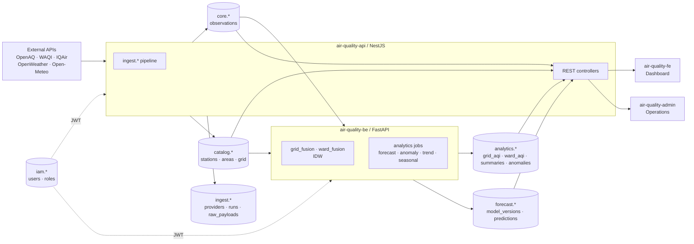

# Cấu trúc cơ sở dữ liệu — `sky_pulse` (PostgreSQL 16)

> Tài liệu này mô tả toàn bộ cấu trúc CSDL hiện hành của hệ thống Chất Lượng Không Khí Việt Nam (DATN). Được tổng hợp trực tiếp từ `db/schema.sql` + `db/migrations/*.sql` (air-quality-api) và `alembic/versions/*.py` (air-quality-be). Phục vụ báo cáo và bàn giao.

## 1. Tổng quan

- **DBMS**: PostgreSQL 16 (Alpine), kết nối qua `asyncpg` (FastAPI) và `pg` (NestJS/MikroORM).
- **Charset/Collation**: `UTF-8`.
- **Extension**: `pgcrypto` (sinh UUID qua `gen_random_uuid()`).
- **Tổng số schema nghiệp vụ**: **8** (`iam`, `catalog`, `app`, `ingest`, `core`, `analytics`, `forecast`, `ops`).
- **Tổng số bảng**: **~46** (36 trong `schema.sql` + 11 thêm qua migrations 001–019 và Alembic 0001/0002).
- **Tổng số view**: **9** view hỗ trợ (1 trong `app`, 8 trong `ops`).
- **PK**: Toàn bộ dùng UUID (`gen_random_uuid()`), trừ bảng quan trắc dùng composite PK `(station_id|grid_point_id, observed_at)`.
- **Audit trail**: cột `created_at` / `updated_at` mặc định `now()` ở mọi bảng nghiệp vụ.

### Sở hữu schema (ownership)

| Service | Schema sở hữu | Schema chỉ đọc |
|---|---|---|
| `air-quality-api` (NestJS) | `iam`, `catalog`, `app`, `ingest`, `core`, `ops`, `forecast.*` (legacy) | — |
| `air-quality-be` (FastAPI) | `analytics.*` (4 bảng be-owned), `forecast` (model_registry/runs/predictions) | `catalog.*`, `core.*` |

## 2. Sơ đồ kiến trúc tổng quát (data-flow)



## 3. Sơ đồ ER (các thực thể trọng yếu)

```mermaid
erDiagram
  USERS ||--o{ USER_ROLES : has
  ROLES ||--o{ USER_ROLES : grants
  USERS ||--o| USER_PROFILES : profile
  USERS ||--o{ REFRESH_SESSIONS : owns
  USERS ||--o{ PINNED : pins
  USERS ||--o{ ALERT_RULES : owns
  USERS ||--o{ NOTIFICATIONS : receives

  AREAS ||--o{ AREAS : parent
  AREAS ||--o{ STATIONS : contains
  AREAS ||--o{ PINNED : on
  AREAS ||--o{ WARD_AQI : analyzed

  STATIONS ||--o{ AQ_OBS : produces
  STATIONS ||--o{ WX_OBS : produces
  STATIONS ||--o{ BINDINGS : bound_to
  GRID_POINTS ||--o{ GRID_AQI : observed

  PROVIDERS ||--o{ ENDPOINTS : exposes
  ENDPOINTS ||--o{ BINDINGS : binds
  ENDPOINTS ||--o{ PIPELINE_RUNS : runs
  PIPELINE_RUNS ||--o{ OUTBOUND_REQ : issues
  OUTBOUND_REQ ||--|| RAW_PAYLOADS : captures
  RAW_PAYLOADS ||--o{ NORMALIZE_RUNS : feeds
  NORMALIZE_RUNS ||--o{ AQ_OBS : derives
  NORMALIZE_RUNS ||--o{ WX_OBS : derives

  MODEL_REG ||--o{ MODEL_VER : versioned
  MODEL_VER ||--o{ TRAIN_RUNS : trained
  MODEL_VER ||--o{ PRED_RUNS : used
  PRED_RUNS ||--o{ PREDICTIONS : emits
  STATIONS ||--o{ PREDICTIONS : for

  STATIONS ||--o{ DAILY_SUM : summarised
  STATIONS ||--o{ ANOMALIES : anomaly
  STATIONS ||--o{ SEASONAL : pattern
  STATIONS ||--o{ CORRELATION : corr
  STATIONS ||--o{ TREND : trend
  STATIONS ||--o{ HEALTH : impact

  USERS {
    uuid id PK
    text email
    text password_hash
    enum status
  }
  AREAS {
    uuid id PK
    uuid parent_id FK
    enum level
    text code
    text name
    double center_lat
    double center_lng
    jsonb metadata
  }
  STATIONS {
    uuid id PK
    uuid area_id FK
    text code UK
    text name
    double lat
    double lng
    enum station_type
    boolean is_active
    jsonb metadata
  }
  GRID_POINTS {
    uuid id PK
    numeric lat
    numeric lng
    text province_code
    text province_name
    boolean is_land
    boolean is_active
  }
  AQ_OBS {
    uuid station_id PK_FK
    timestamptz observed_at PK
    uuid source_endpoint_id FK
    int aqi
    numeric pm25
    numeric pm10
    numeric o3_no2_so2_co
    enum quality_status
  }
  WX_OBS {
    uuid station_id PK_FK
    timestamptz observed_at PK
    numeric temperature_c
    numeric humidity_pct
    numeric wind_speed_mps
  }
  GRID_AQI {
    uuid grid_point_id PK_FK
    timestamptz observed_at PK
    int aqi
    text source_code
    numeric confidence_score
  }
  WARD_AQI {
    uuid ward_id PK_FK
    timestamptz observed_at
    int aqi
    text source_code
    numeric confidence_score
    int station_count
  }
  PROVIDERS {
    uuid id PK
    text code UK
    text name
    boolean is_active
  }
  ENDPOINTS {
    uuid id PK
    uuid provider_id FK
    text code
    enum kind
    text base_url
  }
  BINDINGS {
    uuid station_id PK_FK
    uuid endpoint_id PK_FK
    int priority
    boolean is_enabled
  }
  PIPELINE_RUNS {
    uuid id PK
    uuid pipeline_def_id FK
    enum status
    timestamptz started_at
    int items_in_out
  }
  RAW_PAYLOADS {
    uuid id PK
    uuid request_id FK
    text payload_hash
    jsonb payload
    enum format
  }
  PREDICTIONS {
    uuid prediction_run_id PK_FK
    uuid station_id PK_FK
    timestamptz forecast_for PK
    enum target
    numeric value
  }
```

## 4. Chi tiết theo schema

### 4.1 `iam` — Xác thực & phân quyền

| Bảng | Mục đích | Cột then chốt |
|---|---|---|
| `iam.users` | Tài khoản người dùng (admin/operator/citizen) | `id` PK, `email` UK, `password_hash`, `status` (enum), `metadata` jsonb |
| `iam.roles` | Vai trò (super_admin, admin, operator, analyst, citizen) | `id` PK, `code` UK, `name` |
| `iam.user_roles` | Gán nhiều-nhiều user ↔ role | `user_id` FK, `role_id` FK, PK `(user_id, role_id)` |
| `iam.user_profiles` | Thông tin mở rộng 1-1 | `user_id` PK/FK, `display_name`, `locale` |
| `iam.refresh_sessions` | Refresh token sessions (JWT rotation) | `id` PK, `user_id` FK, `token_hash`, `expires_at` |
| `iam.password_reset_tokens` *(mig 012)* | Token reset mật khẩu | `id` PK, `user_id` FK, `token_hash`, `expires_at` |

**Enum**: `user_status_enum {active, invited, disabled}`.

### 4.2 `catalog` — Danh mục địa lý

| Bảng | Mục đích | Cột then chốt |
|---|---|---|
| `catalog.areas` | Đơn vị hành chính 2 cấp (tỉnh → xã/phường) sau cải cách 2025 | `id` PK, `parent_id` FK (self), `level` enum, `code` (UNIQUE với `level`), `name`, `center_lat/lng`, `metadata` (source, cap, province_code) |
| `catalog.stations` | Trạm quan trắc (seed + discovered từ WAQI) | `id` PK, `code` UK, `area_id` FK, `lat/lng`, `station_type` enum, `is_active`, `timezone`, `metadata` (source) |
| `catalog.grid_points` *(mig 014)* | Lưới phủ AQI 0.2° (~22 km) toàn VN, ~700 điểm | `id` PK, `lat`/`lng` numeric (UK), `province_code`, `is_land`, `is_active` |

**Enums**: `area_level_enum {province, district, ward}` · `station_type_enum {monitoring, reference, virtual}`.

**Số liệu** *(sau seed migration 018/019)*: 44 area province (34 GSO + 10 cũ), **3 321 area ward** (98% có centroid), ~700 grid_points, ~22 trạm active (12 seed + 10 WAQI discovered).

### 4.3 `app` — User-facing

| Bảng | Mục đích | Cột then chốt |
|---|---|---|
| `app.user_pinned_stations` | Trạm được pin theo dõi của user | `user_id` FK, `station_id` FK, PK `(user_id, station_id)` |
| `app.user_preferences` | Cài đặt cá nhân (units, theme, language) | `user_id` PK/FK, `prefs` jsonb |
| `app.user_alert_rules` | Quy tắc cảnh báo người dùng | `id` PK, `user_id` FK, `station_id` FK, `threshold_aqi`, `channels` enum[] |
| `app.notification_templates` | Mẫu thông báo | `id` PK, `code` UK, `subject_tpl`, `body_tpl` |
| `app.notifications` | Bản ghi thông báo phát ra | `id` PK, `user_id` FK, `template_id` FK, `payload` jsonb |
| `app.notification_deliveries` | Trạng thái giao kênh (push/email/in_app) | `id` PK, `notification_id` FK, `channel`, `status`, `sent_at` |
| `app.push_subscriptions` *(mig 011)* | Web Push subscriptions (VAPID) | `id` PK, `user_id` FK, `endpoint`, `keys` jsonb |
| `app.alert_rules` / `app.alerts` / `app.alert_deliveries` *(mig 003)* | Hệ cảnh báo nâng cao (rule → alert → delivery) | — |

**Enum**: `notification_channel_enum {in_app, email, push, sms}`.

### 4.4 `ingest` — Đường ống thu thập

| Bảng | Mục đích | Cột then chốt |
|---|---|---|
| `ingest.source_providers` | Nhà cung cấp dữ liệu (OpenAQ, WAQI, IQAir, OpenWeather, Open-Meteo) | `id` PK, `code` UK, `name`, `is_active` |
| `ingest.source_endpoints` | URL/endpoint cụ thể của provider | `id` PK, `provider_id` FK, `code`, `kind` enum, `base_url`, `rate_limit_per_minute` |
| `ingest.station_source_bindings` | Gán trạm ↔ endpoint, có `priority` (số nhỏ = ưu tiên cao) | `station_id` FK, `endpoint_id` FK, `priority`, `is_enabled`, `config` jsonb, PK `(station_id, endpoint_id)` |
| `ingest.pipeline_definitions` | Định nghĩa pipeline (cron, schedule, target) | `id` PK, `code` UK, `schedule_cron`, `is_enabled` |
| `ingest.pipeline_runs` | Mỗi lần chạy pipeline | `id` PK, `pipeline_def_id` FK, `status` enum, `started_at`, `finished_at`, `items_in`/`items_out`, `error_summary` |
| `ingest.outbound_requests` | HTTP request đi ra (audit) | `id` PK, `pipeline_run_id` FK, `endpoint_id` FK, `status` enum, `http_status`, `latency_ms` |
| `ingest.raw_payloads` | JSON gốc lưu nguyên, dedup theo `(provider_id, payload_hash)` | `id` PK, `request_id` FK, `payload_hash` UK, `payload` jsonb, `format` enum |
| `ingest.normalize_runs` | Mỗi lần normalize raw_payload → observations | `id` PK, `pipeline_run_id` FK, `raw_payload_id` FK, `rows_in`/`rows_out` |

**Enums**: `endpoint_kind_enum {air_quality, weather, traffic, mixed}` · `run_status_enum {queued, running, success, partial, failed, cancelled}` · `request_status_enum {success, failed, throttled, timeout, skipped}` · `payload_format_enum {json, xml, csv, text}`.

**Priority hiện hành (`station_source_bindings`)**: IQAir = 50, Open-Meteo = 100, OpenWeather = 150, OpenAQ = 150, WAQI = 200.

### 4.5 `core` — Quan trắc chuẩn hoá

| Bảng | Mục đích | Cột then chốt |
|---|---|---|
| `core.air_quality_observations` | AQI/PM2.5/PM10/O3/NO2/SO2/CO mỗi giờ/trạm | PK `(station_id, observed_at, source_endpoint_id)`, `aqi` int, `pm25..co` numeric, `quality_status` enum, lineage FK `(pipeline_run_id, raw_payload_id, normalize_run_id)` |
| `core.weather_observations` | Nhiệt độ, độ ẩm, gió, áp suất | PK tương tự, `temperature_c`, `humidity_pct`, `wind_speed_mps`, `pressure_hpa`, `visibility_km`, `weather_code` |
| `core.traffic_observations` | Mật độ/tốc độ giao thông (placeholder cho phân tích nhân quả) | PK tương tự, `density`, `avg_speed_kph` |

**Enum**: `quality_status_enum {valid, suspect, invalid, estimated}`.

**Upsert pattern**: `ON CONFLICT (station_id, observed_at, source_endpoint_id) DO UPDATE` → idempotent, chạy lại không nhân bản.

### 4.6 `analytics` — Phân tích & ML features

| Bảng | Owner | Mục đích | Cột then chốt |
|---|---|---|---|
| `analytics.feature_snapshots` | api | Snapshot feature cho ML | `id` PK, `station_id`/`area_id`, `snapshot_time`, `features` jsonb |
| `analytics.analysis_runs` | api | Mỗi lần phân tích chạy | `id` PK, `analysis_type` enum, `started_at`, `params`, `metrics` |
| `analytics.station_daily_summaries` | api | Tóm tắt ngày/trạm (avg/min/max AQI) | `station_id` FK, `summary_date`, PK `(station_id, summary_date)` |
| `analytics.anomaly_events` | api | Sự kiện bất thường (legacy schema gốc) | `id` PK, `station_id`, `detected_at`, `severity` |
| `analytics.analysis_reports` | api | Báo cáo dạng PDR/markdown | `id` PK, `analysis_run_id` FK, `body` text |
| `analytics.daily_summaries` *(mig 004)* | be | Daily summary do FastAPI sinh (AQ + weather) | PK `(station_id, summary_date)` |
| `analytics.anomalies` *(mig 004)* | be | Anomaly z-score/IQR | `id` PK, `station_id`, `detected_at`, `metric`, `z_score`, `iqr_factor`, `severity`, `method` |
| `analytics.seasonal_patterns` *(Alembic 0001)* | be | Profile theo giờ/dow 30 ngày | `id` PK, `station_id`, `analysis_date`, `hourly_profile` jsonb, `peak_hours` int[] |
| `analytics.correlation_matrices` *(Alembic 0001)* | be | Pearson r giữa các chỉ số | `id` PK, `station_id`, `analysis_date`, `correlations` jsonb |
| `analytics.trend_analyses` *(Alembic 0001)* | be | Slope + direction 30 ngày | `id` PK, `station_id`, `trends` jsonb, `overall_direction` |
| `analytics.health_impacts` *(Alembic 0001)* | be | EPA exposure score + advice vi/en 48h | `id` PK, `station_id`, `current_level`, `exposure_score`, `advice_vi`, `advice_en` |
| `analytics.grid_aqi_observations` *(mig 015)* | be | AQI 0.2° lưới VN (Open-Meteo + IDW fusion + ML predict) | PK `(grid_point_id, observed_at)`, `aqi`, `source_code` (`openmeteo`/`fused`/`ml_predicted`), `confidence_score` |
| `analytics.ward_aqi_observations` *(Alembic 0002)* | be | AQI phân tích cho TỪNG XÃ/PHƯỜNG bằng IDW từ trạm thật | PK `ward_id`, FK→`catalog.areas`, `aqi`, `source_code='idw_stations'`, `confidence_score`, `station_count`, `nearest_km` |

**Enum**: `analysis_type_enum {daily_summary, trend, anomaly, correlation, root_cause, forecast_review}`.

### 4.7 `forecast` — Dự báo & model registry

| Bảng | Mục đích |
|---|---|
| `forecast.model_registry` | Mô hình (Prophet/ARIMA/LinearRegression/GradientBoost) |
| `forecast.model_versions` | Phiên bản model (champion/challenger), `status` enum |
| `forecast.training_runs` | Lần training (training_rows, metrics, artifact_uri) |
| `forecast.prediction_runs` | Lần predict (horizon, started_at, metrics) |
| `forecast.predictions` | Bản ghi dự báo theo (run, station, forecast_for, target) |
| `forecast.forecast_runs` *(mig 004)* | Run dự báo cho UI dashboard (Prophet 24h, ARIMA 12h, Linear 24h), MAE/RMSE/MAPE |
| `forecast.forecast_points` *(mig 004)* | Điểm dự báo per `forecast_run_id`, `predicted_at`, `lower/upper_bound` |

**Enums**: `model_status_enum {draft, training, validated, production, archived}` · `prediction_target_enum {aqi, pm25, pm10, o3, no2, so2, co}`.

### 4.8 `ops` — Vận hành & audit

| Bảng | Mục đích |
|---|---|
| `ops.service_configs` | Config runtime per service (key-value, hot reload) |
| `ops.service_health_checks` | Health check ping mỗi service |
| `ops.audit_logs` | Audit mọi thay đổi quan trọng (`actor_user_id`, `action`, `target`, `payload`) |
| `ops.alembic_version` *(Alembic)* | Version migration của air-quality-be |

**Enum**: `service_name_enum {be_api, be_data, fe_admin, scheduler, system}`.

## 5. Quan hệ khoá ngoại trọng yếu

```
iam.users  ←─ user_roles ─→  iam.roles
iam.users  ─1─→  iam.user_profiles
catalog.areas ─self─→ catalog.areas (province → ward)
catalog.areas ─1─→ catalog.stations (area_id)
catalog.areas ─1─→ analytics.ward_aqi_observations  ← (FK ward_id)
catalog.stations ─1─→ core.air_quality_observations / weather_observations
catalog.grid_points ─1─→ analytics.grid_aqi_observations
ingest.source_providers ─1─→ ingest.source_endpoints
ingest.source_endpoints ─⨯─→ catalog.stations  (qua ingest.station_source_bindings)
ingest.pipeline_runs ─1─→ ingest.outbound_requests ─1─→ ingest.raw_payloads ─1─→ ingest.normalize_runs
ingest.normalize_runs ─1─→ core.air_quality_observations / weather_observations
forecast.model_versions ─1─→ forecast.training_runs / prediction_runs
forecast.prediction_runs ─1─→ forecast.predictions ─FK─→ catalog.stations
```

## 6. Views

| View | Schema | Mục đích | Quan trọng |
|---|---|---|---|
| `app.v_station_latest_air_quality` | app | AQI mới nhất per trạm (LATERAL join tối ưu) | **Đã nâng cấp ở migration 017** — chọn theo provider priority: `waqi(1) > iqair(2) > openweather(3) > openmeteo(4) > openaq(5)` cho data ≤ 6h, fallback newest cho mọi nguồn |
| `ops.v_pipeline_run_overview` | ops | Tổng quan pipeline (định nghĩa, status, metrics) | Quản trị vận hành |
| `ops.v_station_source_latest` | ops | Truy ết: trạm → observation → raw_payload → pipeline | Debugging |
| `ops.v_observation_full_lineage` | ops | Lineage đầy đủ: obs ← normalize ← raw ← request ← run | Audit |
| `ops.v_prediction_full_lineage` | ops | Lineage prediction ← model_version ← training_run | Reproducibility |
| `ops.v_analysis_run_lineage` | ops | Lineage analysis ← station/area | Audit |
| `ops.v_station_bindings_overview` | ops | Ánh xạ station ← endpoint ← provider | Cấu hình |
| `ops.v_provider_health` | ops | Sức khoẻ provider (rate limit, last_success, latency) | Monitoring |
| `ops.v_model_production_status` | ops | Model nào đang production | ML governance |

## 7. Migrations đã áp dụng

### 7.1 `air-quality-api/db/migrations/` (psql, theo thứ tự)

| # | Migration | Tóm tắt |
|---|---|---|
| 001 | `station_analytics.sql` | View dashboard kết hợp latest + 24h summary + forecast |
| 002 | `expand_ingest.sql` | Mở rộng ingest (providers, endpoints, bindings, runs, raw_payloads, normalize) |
| 003 | `alerts_system.sql` | Hệ cảnh báo (rules → alerts → deliveries) |
| 004 | `analytics_ml.sql` | daily_summaries, anomalies, forecast_runs/points, model registry |
| 005 | `waqi_provider.sql` | Đăng ký provider WAQI + endpoint feed/bounds |
| 006 | `advanced_analytics.sql` | Mở rộng analytics (snapshot, runs) |
| 007 | `bootstrap_stations.sql` | Seed 12 trạm gốc VN + binding default |
| 011 | `push_subscriptions.sql` | Web Push (VAPID) |
| 012 | `password_reset_tokens.sql` | Reset password flow |
| 013 | `quiet_hours.sql` | User preference: không nhận thông báo theo giờ |
| 014 | `grid_points.sql` | **`catalog.grid_points`** — lưới 0.2° toàn VN |
| 015 | `grid_aqi_observations.sql` | **`analytics.grid_aqi_observations`** (composite PK) |
| 016 | `oauth_columns.sql` | OAuth Google/Facebook columns trên `iam.users` |
| 017 | `station_latest_provider_priority.sql` | **Đổi view ưu tiên WAQI > IQAir > OpenWeather > Open-Meteo > OpenAQ** |
| 018 | `areas_vn_2025.sql` | **Seed 34 tỉnh + 3 321 xã/phường chuẩn GSO 2025** |
| 019 | `areas_vn_2025_centroids.sql` | **Centroid lat/lng cho 3 263/3 321 xã** (98%) |

### 7.2 `air-quality-be/alembic/versions/` (Alembic)

| Revision | Tóm tắt |
|---|---|
| `0001_analytics_be` | Baseline 4 bảng be-owned: `seasonal_patterns`, `correlation_matrices`, `trend_analyses`, `health_impacts` |
| `0002_ward_aqi` | **`analytics.ward_aqi_observations`** + index — phân tích AQI cho từng xã/phường bằng IDW từ trạm thật |

## 8. Số liệu hiện tại (snapshot)

| Đối tượng | Số lượng | Ghi chú |
|---|---|---|
| `catalog.areas` (province) | 44 | 34 GSO 2025 + 10 cũ (mã chữ) |
| `catalog.areas` (ward) | 3 321 | Cải cách 2025; 98% có centroid |
| `catalog.stations` | ~81 | 22 active (12 seed + 10 WAQI inVN), 59 WAQI-discovered inactive |
| `catalog.grid_points` | ~700 | Lưới 0.2° phủ VN |
| `ingest.source_providers` | 5 | OpenAQ, WAQI, IQAir, OpenWeather, Open-Meteo |
| `analytics.grid_aqi_observations` | ~5 600 dòng/ngày | 700 điểm × 8 lần/ngày (cron 3h) |
| `analytics.ward_aqi_observations` | ~1 355 dòng | Mỗi cron ward_fusion upsert ~1 320–1 355 xã có ≥1 trạm trong 50 km |
| Frequency | | Open-Meteo hourly · OpenWeather 3h · WAQI 3h · IQAir 6h · OpenAQ 6h |

## 9. Convention chung

- **Đặt tên**: `snake_case`. Schema/bảng/cột nghiệp vụ luôn dùng tiếng Anh; nội dung địa danh tiếng Việt có dấu.
- **PK**: UUID v4 (`gen_random_uuid()`), trừ bảng observation dùng composite PK theo trục thời gian.
- **FK**: Tất cả `ON DELETE`:
  - `CASCADE` cho dữ liệu phụ thuộc (bindings, deliveries, payloads).
  - `RESTRICT` cho observations (giữ lịch sử).
  - `SET NULL` cho relationship optional (area của station).
- **Timestamps**: dùng `timestamptz` (UTC); FE tự convert theo Asia/Ho_Chi_Minh.
- **JSONB**: dùng cho payload thô, metadata, config, feature snapshot.
- **Indexes**: ngoài PK còn có UNIQUE (level+code, payload_hash, station_id+observed_at+source_endpoint_id) và btree cho cột truy vấn cao (observed_at, fetched_at, area_id).
- **Idempotency**: mọi upsert pipeline đều dùng `ON CONFLICT … DO UPDATE`.

## 10. Lưu ý vận hành cho báo cáo

- Hai service `air-quality-api` và `air-quality-be` **PHẢI dùng chung 1 database** (mặc định `localhost:5432/sky_pulse`). Docker-compose của be tạo postgres riêng 5433 chỉ dùng khi chạy độc lập (không tích hợp).
- Tất cả 3 đường ống dữ liệu (ingest → normalize → analytics/forecast) đều ghi audit lineage để truy vết từ `predictions`/`ward_aqi` ngược về `raw_payload` HTTP gốc.
- View `app.v_station_latest_air_quality` (migration 017) là nguồn dữ liệu chính cho dashboard FE — bảo đảm hiển thị giá trị từ trạm thật (WAQI/IQAir) thay vì mô hình (Open-Meteo) khi sẵn có.
